# Bank Simulation #

#### Arquitectura

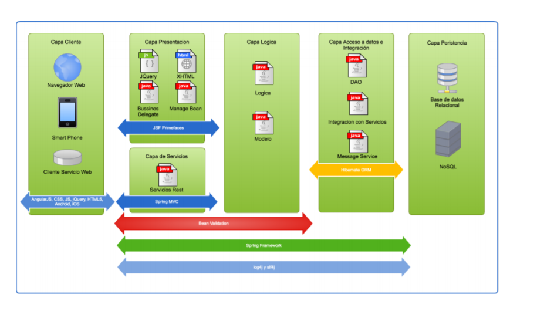

#### Database

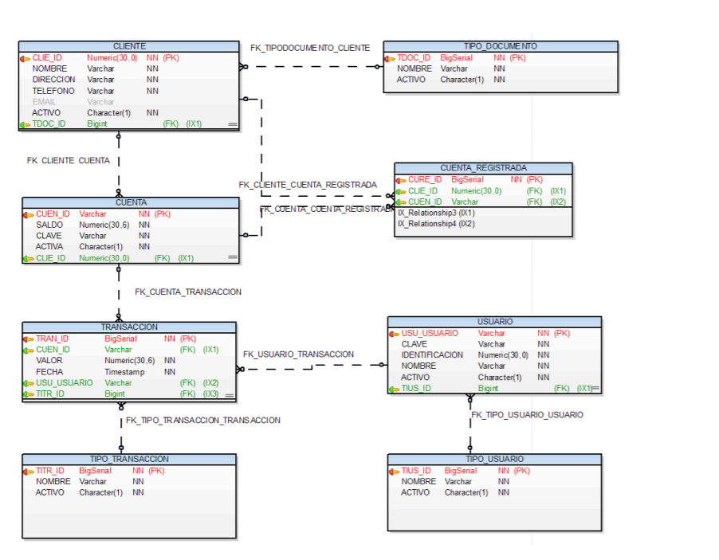

#### Requisitos ###

##### Modulo de administracion
- Numero de cuenta automatico (4560-3456-9999-8921)
- Clave cuenta automatica
- Crear cliente automaticamente se le crea una cuenta
- Consignacion 200.000 activa la cuenta
- Ingreso usuario y password

###### Cajero
- consignaciones Listo
- retiros

###### Asesor comercial
- crea clientes Listo
- modifica clientes Listo
- consulta Listo
- inhabilita Listo
- crea cuentas Listo

###### Administrador
- gestion todas tablas
- no retiros
- no consignaciones

##### Modulo clientes
- ingreso identificacion,cuenta y clave cuenta (cuenta activada)
-  informacion sobre retiros, consignaciones, traslados y saldos de las cuentas
- al realizar traslados solo puede ser entre sus cuenta
- se cobra 900 por traslado cuenta 9999-9999-9999-9999
- cliente puede cambiar su clave
- cliente solo podra modificar la dirección, email y teléfono
- el cliente podra registrar cuentas de otro cliente
- cuenta registrada debe el tipo de documento, número de identificación y número de cuenta a registrar
- registrar sus propias cuentas para realizar traslados

##### Modulo de cajero
- realizar retiros envia  el número de cuenta, clave, valor a retirar.
- El servicio debe retornar si se puede entregar el dinero al cliente y el nuevo saldo de la cuenta

#### Demo

##### Modulo Seguridad

###### Login Usuario

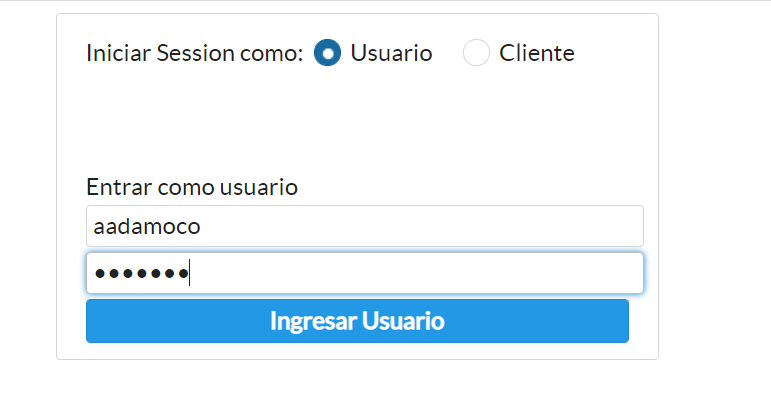

###### Login Cliente

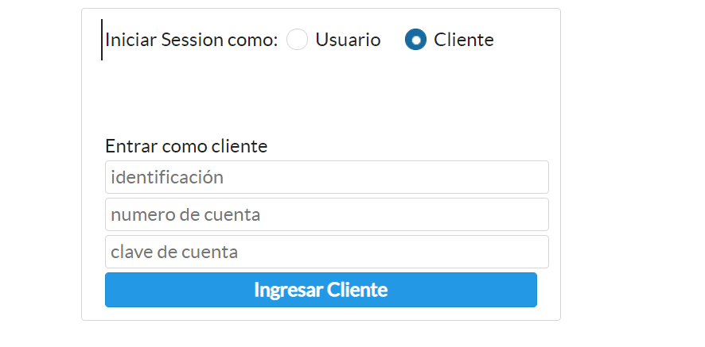

##### Modulo Administrativo

###### Crear Un Usuario

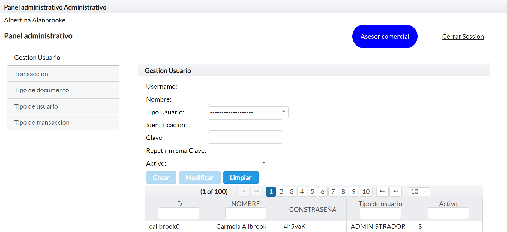

###### Buscar Usuarios

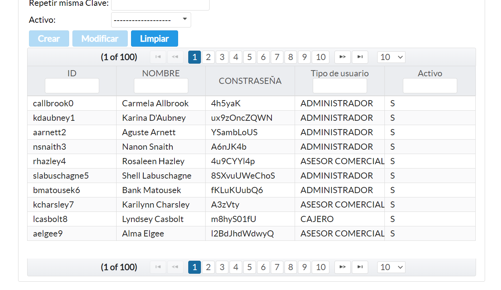

###### Consultar Movimientos

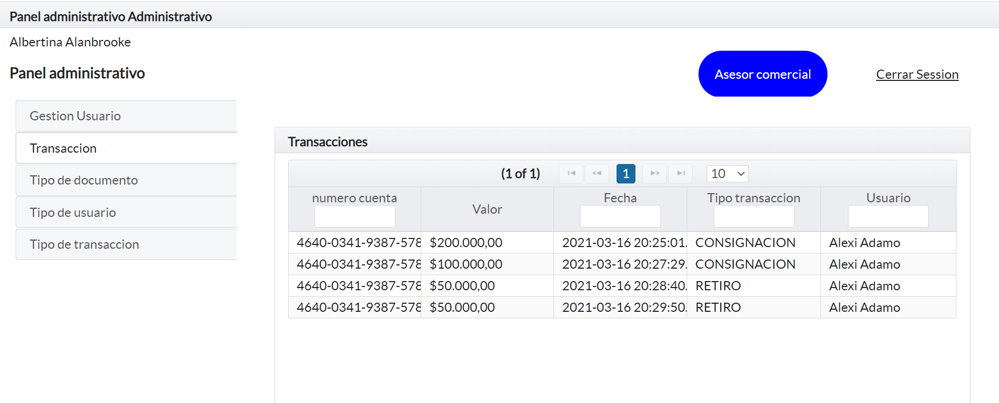

###### Administrar Tipo De Documento

###### Administrar Tipo De Usuario

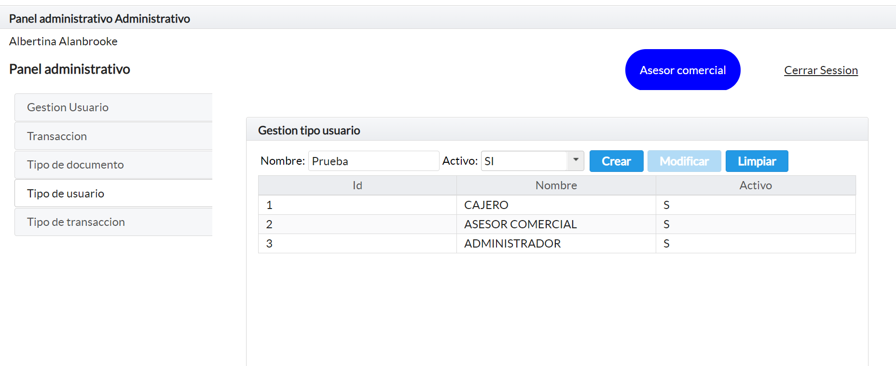

###### Administrar Tipo De Transación

##### Modulo Asesor

###### Crear Un Cliente

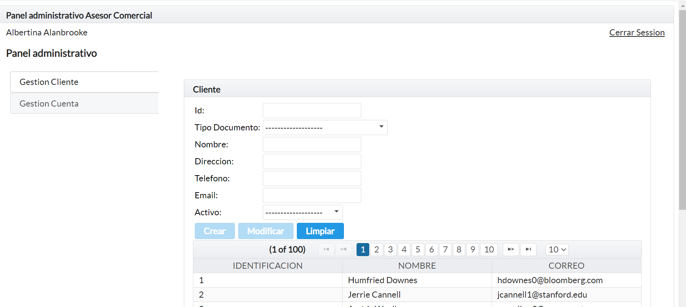

###### Consultar Un Cliente

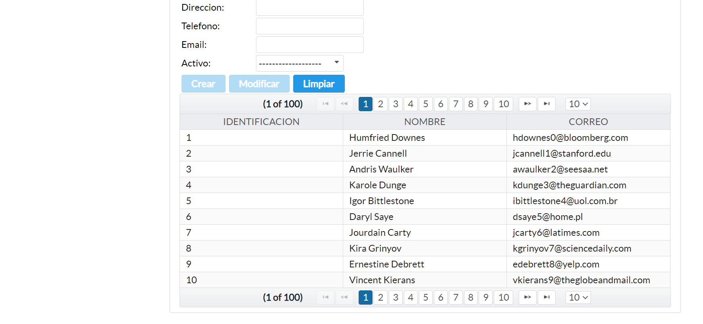

###### Crear Una Cuenta

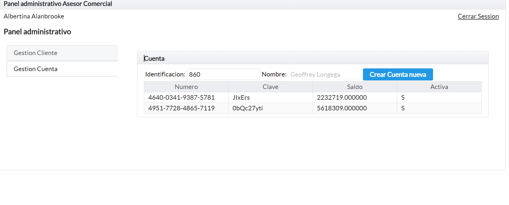

##### Modulo Cajero

###### Consignacion

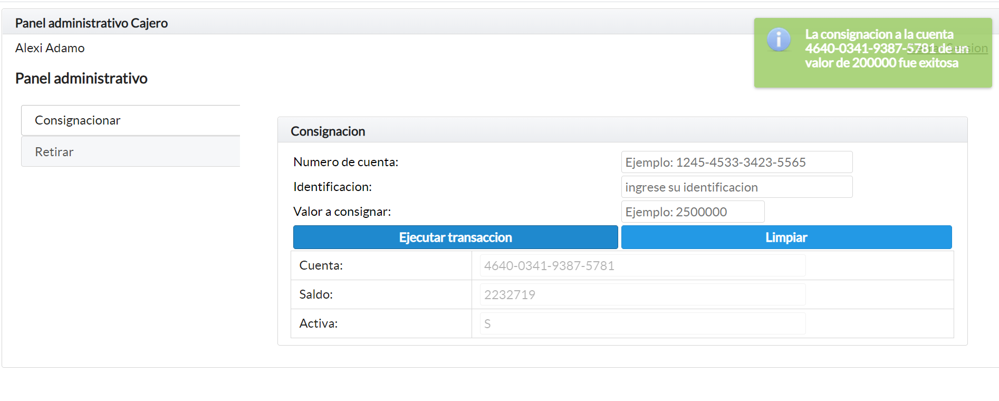

###### Retiros

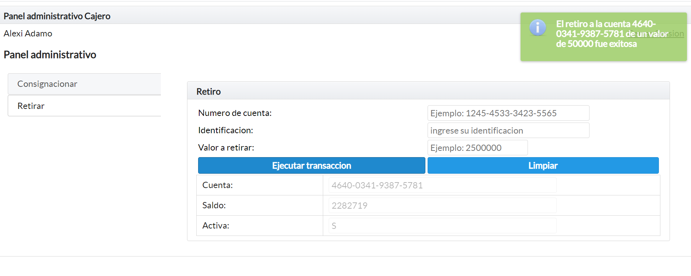

##### Modulo Cliente

###### Mi Perfil

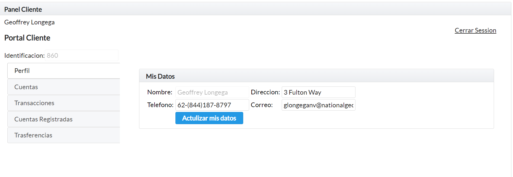

###### Mis Cuentas

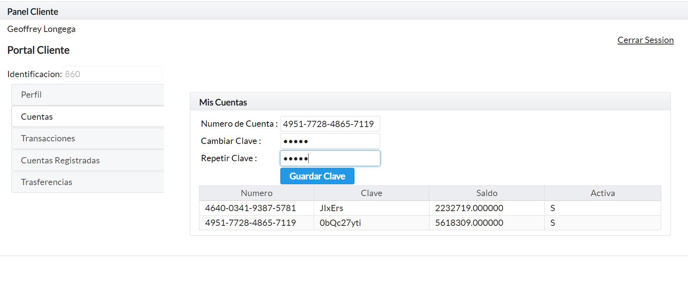

###### Mis Transaciones

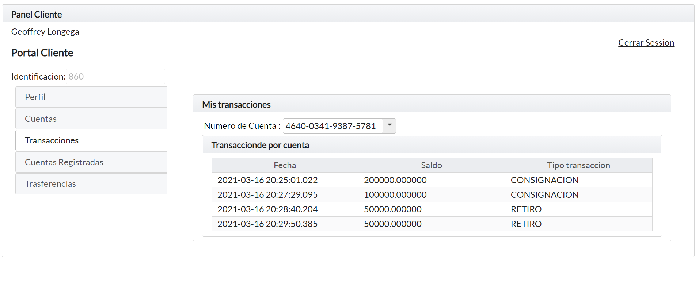

###### Mis Cuentas Registrada

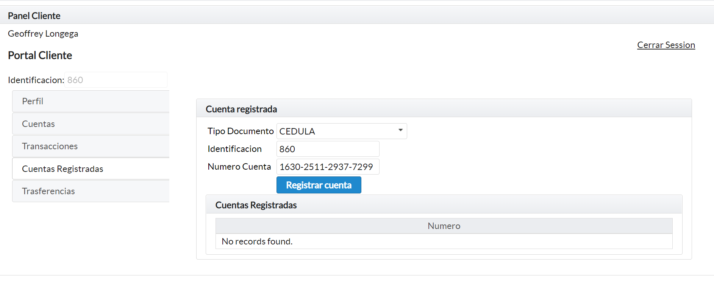

###### Trasferencias

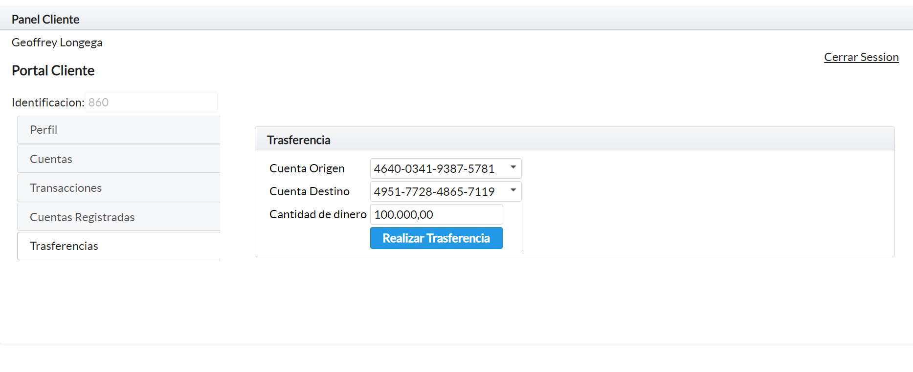
