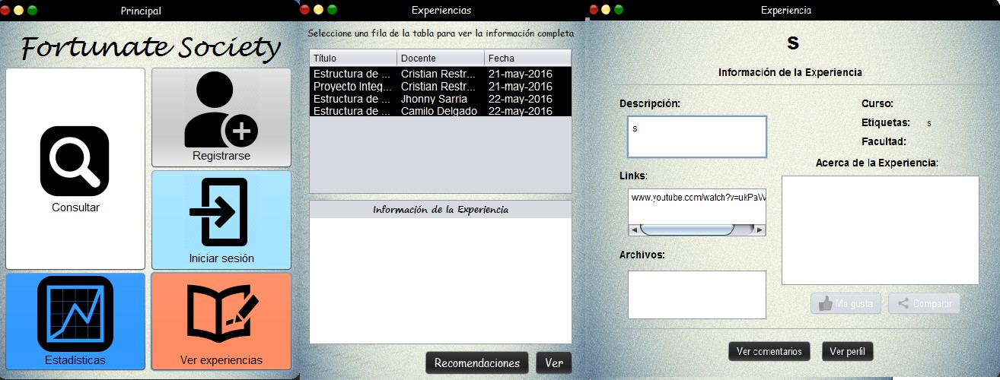
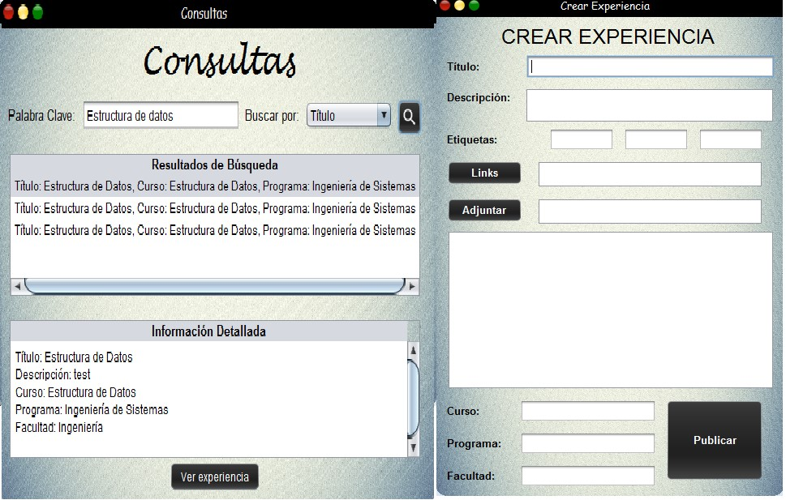
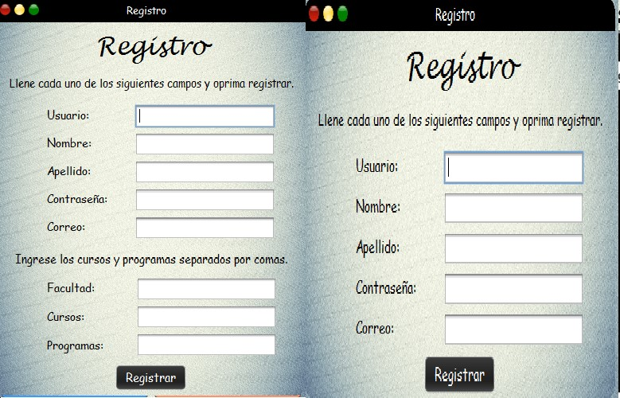
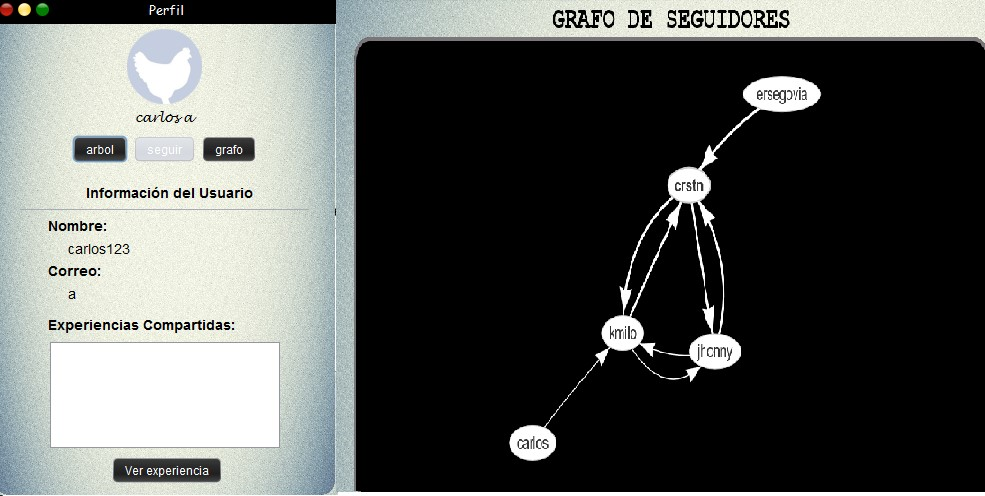
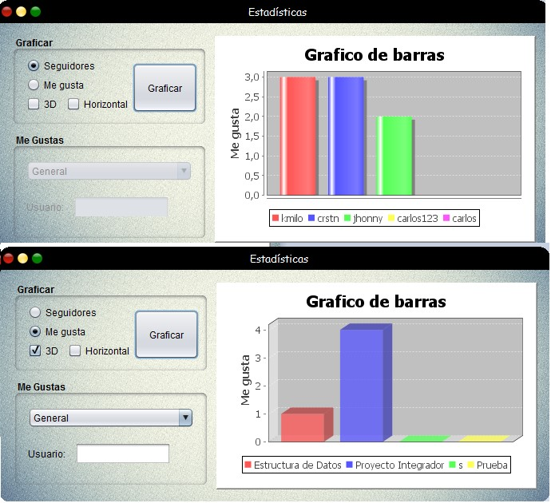

# Red Socierty #

#### Requisitos ###
- La aplicación puede registrar a un usuario nuevo.
- La aplicación puede registrar a un docente nuevo.
- Cada docente puede crear una experiencia nueva.
- Los usuarios pueden comentar las experiencias docentes.
- La aplicación permite realizar la búsqueda de experiencias ya sea por nombre, docente, fecha, etc.
- Un usuario puede dar “me gusta” o “ya no me gusta” a una experiencia.
- Un usuario puede compartir una experiencia.
- Un usuario puede compartir experiencias en su perfil.
- Un usuario puede ver los perfiles de otros usuarios
- Un usuario puede ver los comentarios de una experiencia
- Un usuario puede seguir a  otros usuarios
- Un usuario ver la red de seguidores de los usuarios
- Se pueden ver recomendaciones de las experiencias
- Los usuarios tienen perfil donde aparecen las experiencias compartidas.
- Los docentes tienen perfil donde aparecen las experiencias creadas.
- Las personas pueden ver todas las experiencias creadas y visualizar su contenido.
- Se generan graficas de mayor seguidores y mayor me gusta

#### Demo

###### Login

###### Consulta

###### Registro

###### Grafo De Recomendacion

###### Estadisticas

