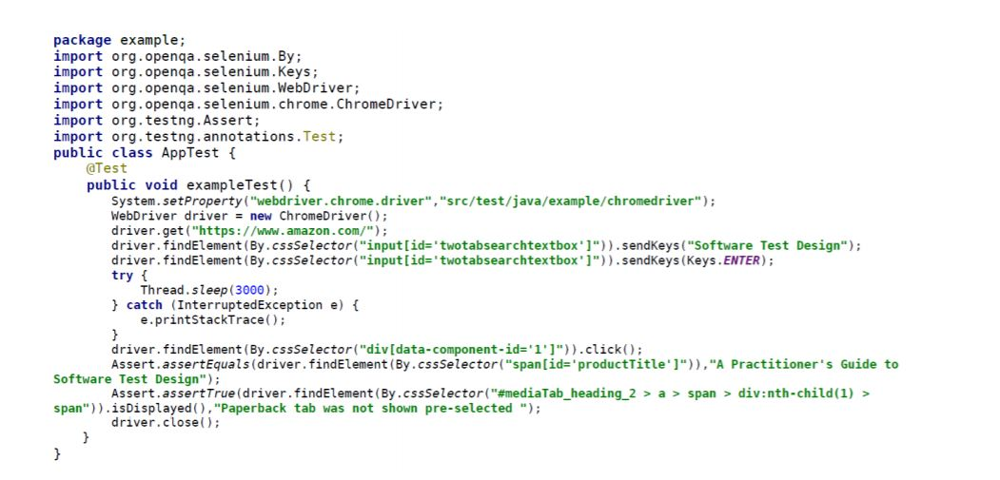
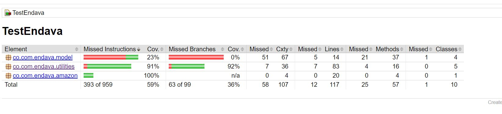
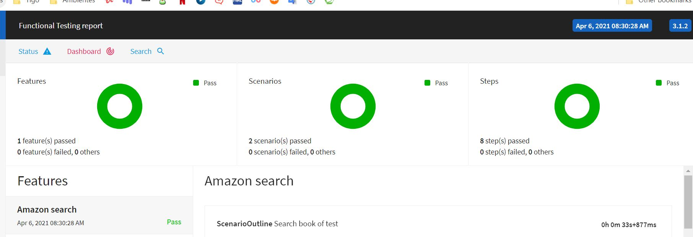
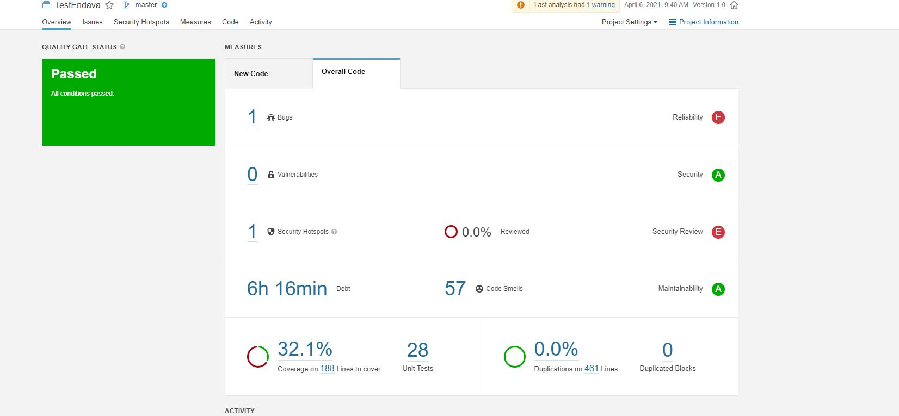

# Test Endava
Running
`mvn install test -Dtest=AllTests -DfailIfNoTests=false -Dmaven.test.failure.ignore=true -Dcucumber.options=src/test/resources/features/amazon.feature`

## Test

### Part 1

Review the following code. Document your thoughts and fix / re-structure where you consider
appropriate. Please share everything you change or suggest in the Tech interview.

NOTE:
- This is Java/Selenium/Maven intended code but you can use your preferred setup as long as you
provide a setup-file or a complete read-me file.
- All changes you provide will be evaluated. Executable code is mandatory
- Code at least another 3 assertions
- Send the finished test at least two days before the tech interview. (Upload the tests to a remote
repository and share the url for a bonus)
- Document any assumptions made

### Part 2

Algorithm Problem:
Write a function that reverses characters in (possibly nested) parentheses in the input string.
Input strings will always be well-formed with matching ()s.
Example
- For inputString = "(bar)", the output should be
reverseInParentheses(inputString) = "rab";
- For inputString = "foo(bar)baz", the output should be
reverseInParentheses(inputString) = "foorabbaz";
- For inputString = "foo(bar)baz(blim)", the output should be
reverseInParentheses(inputString) = "foorabbazmilb";
- For inputString = "foo(bar(baz))blim", the output should be
reverseInParentheses(inputString) = "foobazrabblim".
Because "foo(bar(baz))blim" becomes "foo(barzab)blim" and then
"foobazrabblim".
Input/Output
- [input] string inputString
- A string consisting of lowercase English letters and the characters ( and ). It is guaranteed
that all parentheses in inputString form a regular bracket sequence.
- Guaranteed constraints:
0 ≤ inputString.length ≤ 50.
- [output] string
- Return inputString, with all the characters that were in parentheses reversed

* * *

### Solucion

#### Parte 1

Para la solucion se implemento dos tecnicas, en una se utilizo TDD(Test Driver Development con Junit4) y en el otro caso se implemento BDD(Behavior Driver Development con Cucumber)

1. TDD:
	- **AppTest.java:** Contiene la implementacion de la prueba y las validaciones de la prueba	
	- **Amazon.java:** Componente encargado de interactura e realizas las funciones de la prueba e interactura con el website
	- **amazonData.csv:** archivo .csv que contiene la data de las pruebas	
2. BDD:
	- **AmazonTestRunner.java:** Contiene la implementacion de la prueba y generacion del reporte	
	- **BDDAmazonTest.java:** Contiene la implementacion del paso a paso de la prueba con las respectivas validaciones
	- **Amazon.java:** Componente encargado de interactura e realizas las funciones de la prueba e interactura con el website
	- **amazon.feature:** archivo que contiene el escenario de las pruebas la data y esta implementado en lenguaje gherkin
	
#### Parte 2

Para la solucion planteada la implementacion de 2 algoritmos diferentes, para el caso que hay jerarquía entre los parentesis y para el caso que esto no aplica, adicionalmente la solucion se optimizo y se realizo para un patron n utilizando expresione regulares, es decir no solo sirve con "()" se le puede adicionar otras delimitadores como "<>", sin necesidad de modificar codigo por medio de la funcion `reverseCadena` de la clase utilities `StringReverse`

> Nota: Se asumieron esto escenarios para la implementacion del algoritmo
> - Sin jerarquia example: foo(bar)baz
> - Con jerarquia example: foo(bar(baz))blim
> - Con N-jerarquia example: foo(bar(baz(abc(max))))blim
> - Con mas de 2 N-jerarquia example: foo(bar(baz(abc(max))))blimfoo(bar(baz))blim
> - Sin restricion en la ubicacion de la palabra example: foo(bar(baz)tar)blim
> - Se puede adiciona n delimitador sin modificar codigo solo agregando a las propiedades debe tener apertura y cierre ejemplo: <>,¡!,¿?

1. Sin jerarquía(funciones):
	- **reverseCadenaSin:** esta funcion lo que realiza es un tokenizado por medio de la implementacion de `StringTokenizer`, para recorre las palabras con los delimitadores, y en caso de tener paretesis de antecedente se llama `reverse`		
	- **reverse:** implemetacion de el metodo `reverse` de la clase `StringBuilder`
2. Con jerarquía(funciones):
 	- **reverseCadenaCon2:** esta funcion lo que realiza es un tokenizado por medio de la implementacion de `StringTokenizer`, para recorre las palabras con los delimitadores, y en caso de tener paretesis de antecedente se llama hace un reverso y un merge con la predecesora , algunos casos llamado recursivo
 	- **posicion:** retorna el index de la palabra dentro del arreglo si posee jerarquia en caso contrarion -1
 	- **cadenas:**  trasforma la lista en un String
 	- **reverse:** implemetacion de el metodo `reverse` de la clase `StringBuilder`

##### Pruebas

1. Pruebas de unidad
	- Se realizo las pruebas en la clase `StringReverseTest` parametrizada por medio de un archivo .csv
1. Pruebas de integracion
	- Se realizo las pruebas en la clase `ITStringReverseTest` simulando el comportamiento de la integracion con una capa de datos la cual es `StringRepository`, adicionalmente se trabajo con un modelo `StringTest`

#### Plus Report

##### Reporte de covertura de las pruebas

- pruebas de unidad

- pruebas de integracion

- pruebas de aceptacion

#### Calidad Sonarqube

