# Test Mercado libre
Running

`mvn install test -DfailIfNoTests=false -Dmaven.test.failure.ignore=true`
`mvn package`

## Test
Para monitorear el tráfico interno de MercadoLibre decidimos realizar una herramienta que
enriquezca data sobre nuestros usuarios. Para ello, entre otras fuentes, se necesita que dada
una IP de algun usuario de MercadoLibre se obtenga la siguiente información asociada:
- El nombre y código ISO del país
- Si la IP pertenece a algún servicio de AWS (Amazon Web Services)
- Distancia estimada entre Buenos Aires y el país, en km.

**Información de entrada (IP):**
83.44.196.93
**Información de salida:**
IP: 83.44.196.93
Fecha actual: 01/06/2020 16:01:23 (Utilizar GMT 0)
País: España (spain)
ISO Code: ES
Distancia estimada: 10270 kms
Pertence a AWS: True / False

Basado en la información anterior, es necesario contar con un mecanismo para poder consultar desde
el equipo de Seguridad Informática la siguiente información de los usuarios del sitio.
- Distancia más lejana a Buenos Aires desde la cual se haya consultado el servicio.
- Distancia más cercana a Buenos Aires desde la cual se haya consultado el servicio.
- Cantidad de invocaciones promedio que se hayan hecho del servicio por país.

**Ejemplo:**
IP País Distancia Invocaciones
1.1.1.1 Argentina 0 10
2.2.2.2 Brasil 2862 100
3.3.3.3 España 10040 50
4.4.4.4 España 10040 30

- Distancia más lejana a Buenos Aires desde la cual se haya consultado el servicio
	-  La IP 3.3.3.3 de España con 50 invocaciones (Se queda con la IP con
más invocaciones si empatan la distancia)
- Distancia más cercana a Buenos Aires desde la cual se haya consultado el
servicio:
	- La IP 1.1.1.1 de Argentina con 10 invocaciones
- Cantidad de invocaciones promedio que se hayan hecho del servicio por país
	- Si nos piden españa sería (30+50)/2 = 40
	- Si nos piden Brasil sería 100

Por regulaciones de compliance se necesita tener un log de consultas sobre este último punto,
guardando horario de la consulta y usuario.El usuario es aquel que se provee en el header
HTTP “user_id”. Este log debe guardarse en formato CSV, ordenado por hora de la consulta.
Para garantizar la integridad del archivo, sólo está permitido que el sistema agregue líneas al
archivo, no debe modificar líneas ya existentes ( APPEND )

Este servicio de estadísticas es un servicio que va a ser utilizado potencialmente por
todas las apps de Mercadolibre. Por lo tanto , puede recibir fluctuaciones agresivas de tráfico
(Entre 100 y 100 mil de peticiones por segundo). La API deberá responder correctamente
ante estas fluctuaciones.

### Solucion

Para la solucion del problema de transacionalizada y de disponibiliada, se penso en una arquitectura de microservicios, por medio de un api-gateway(zuul,eureka) como enrutador utilizando balanceo de cargas(ribbon,hystrix) para n-instancias del microservicio, adicionalmente para la trazabilidad se implemento sleuth con zipkin-server, tambien se realizaron los siguiente supuestos en el diseño pero no se implementaron:

- Si la efectividad del servicion baja a mas del 90%, se implementaria encolamiento de peticiones por medio de rabbitMQ, a las peticiones que fallaron
- Para el monitoreo del microservicio se podria implementar metricas por medio de prometheus

##### Arquitectura
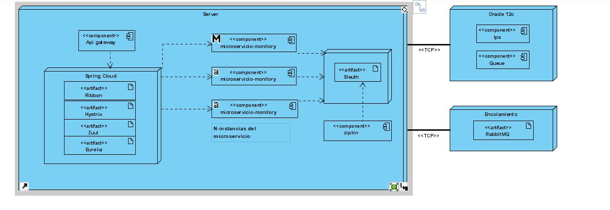
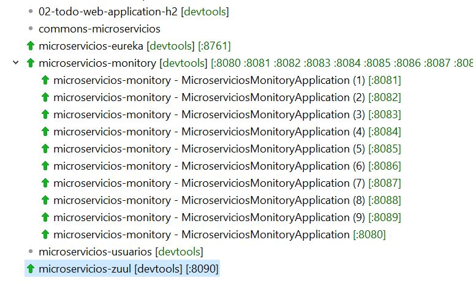
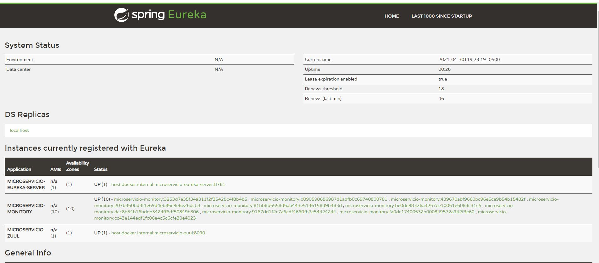

##### Microservicio-monitory

###### metodo register

###### metodo report
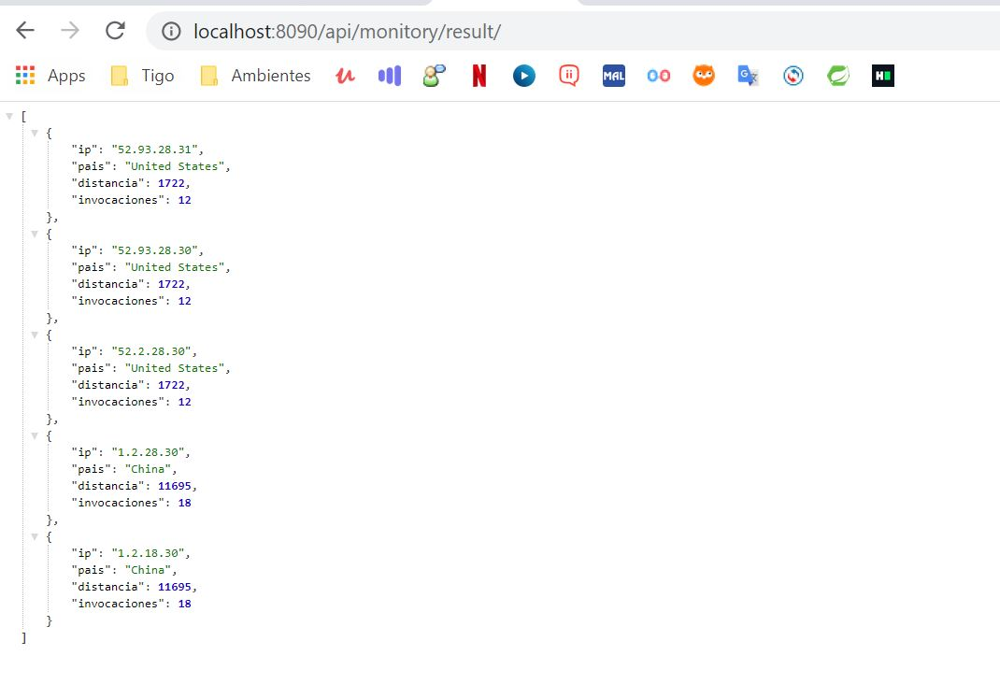

###### metodo Ips
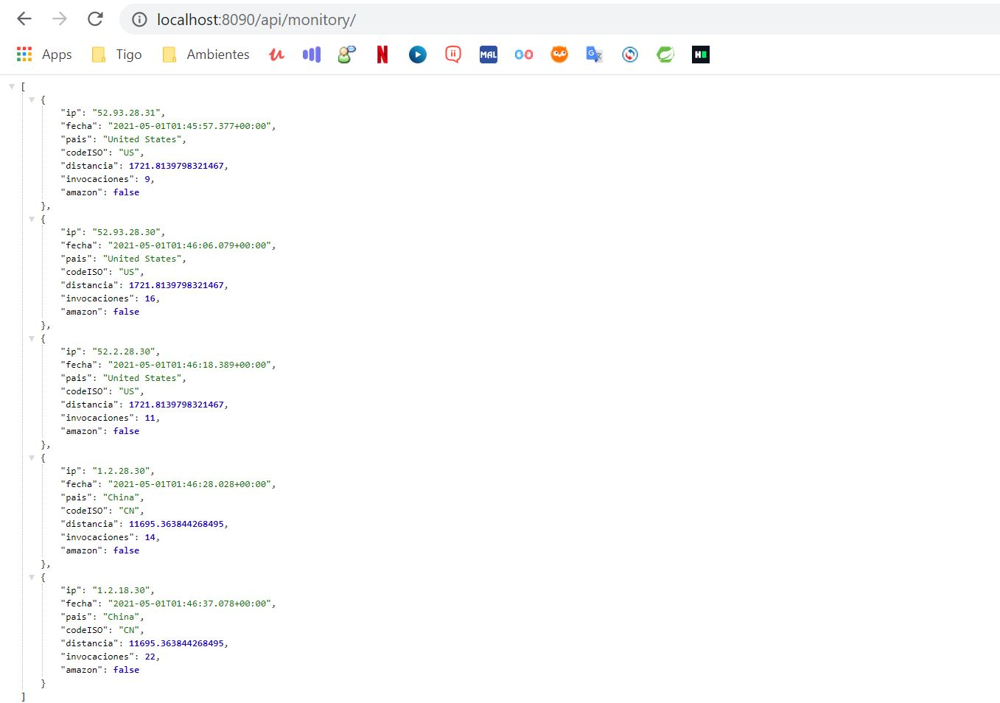

###### metodo Users
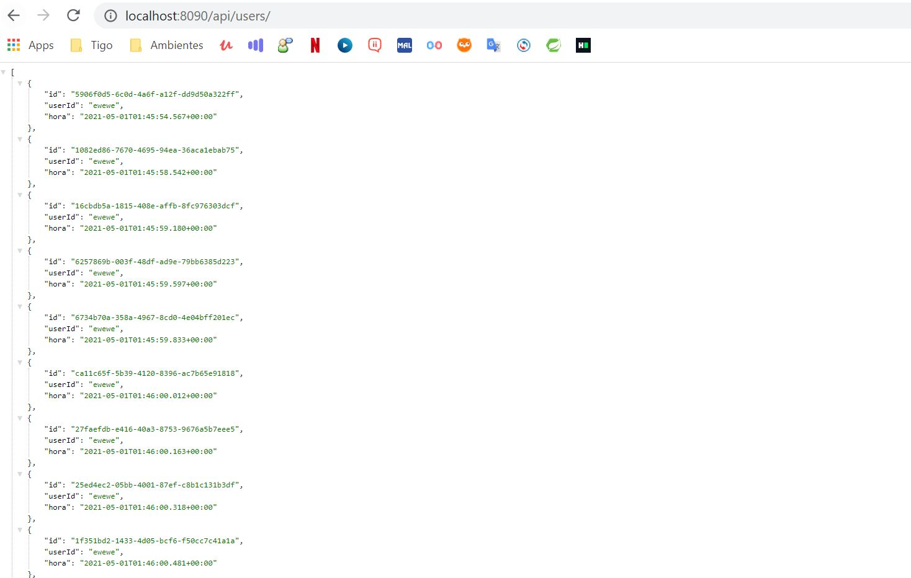

##### Trazabilidad con zipkin
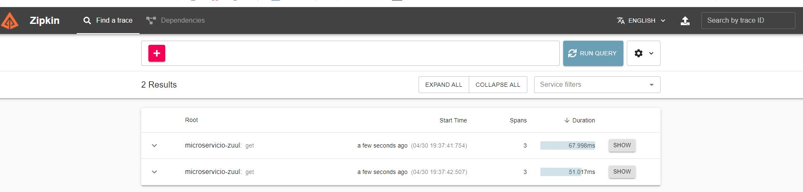
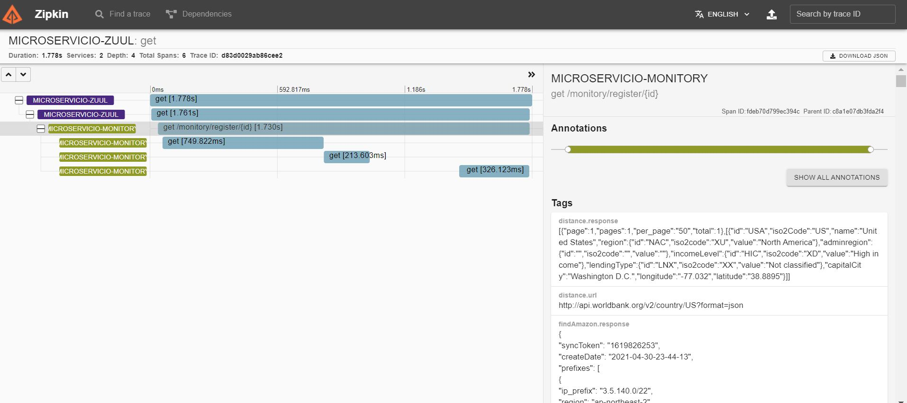

##### Pruebas

###### Cobertura
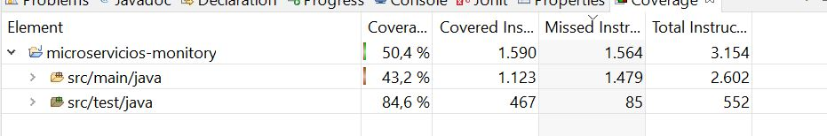

#### Plus Report

##### Reporte de Carga

Se realizaron pruebas de carga y concurrecion con una arquitectura con 9 instancias del microservicio monitory, los resultados fue una efectividad del 95%, esta prueba se realizo con 1000 peticiones por segundo se envio.
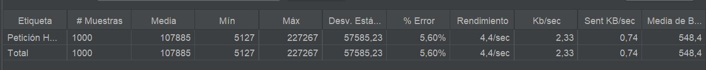
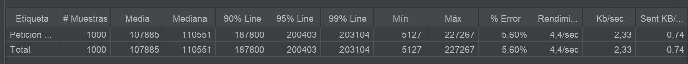
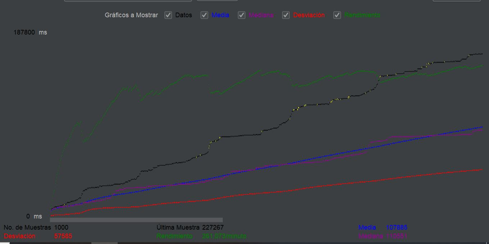
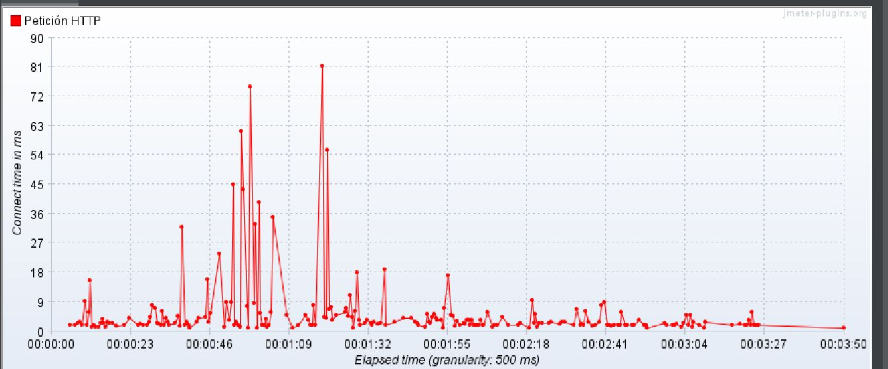
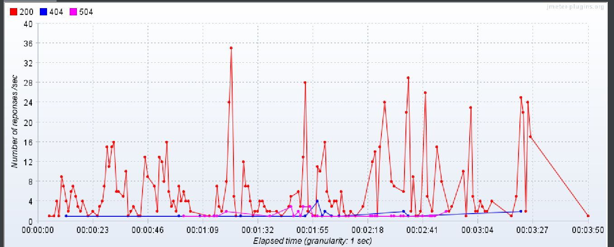
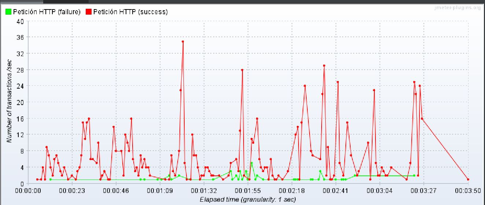

