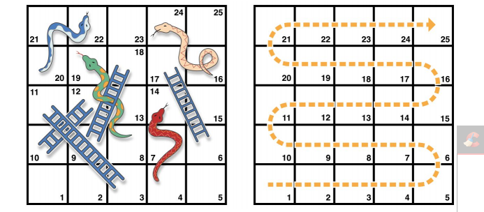

# Juego de escalera

La siguiente es una prueba que tiene como objetivo conocer el nivel de abstracción, lógica,investigación, recursividad y velocidad de aprendizaje del aplicante. La prueba no tiene como objetivo asustarlo, todo lo contrario: está diseñada para medir su nivel de curiosidad y su pasión por la tecnología.

El ejercicio es de una complejidad media, pero puesto que la práctica es paga, queremos
cerciorarnos que el practicante está a la altura.

- - -

#### Las reglas del juego son:
- El tablero tiene 25 cuadros, y el objetivo es llegar o superar el cuadro 25
- El cuadro inicial es el 0, el cual se encuentra por fuera del tablero a la izquierda del cuadro 1
- En cada turno usted tira un dado de 6 lados y mueve el número de cuadrados siguiendol a línea punteada de la imagen
- Si su turno termina en la parte inferior de una escalera, sube por la escalera
- Si su turno termina en la cabeza de una serpiente, baja por la serpiente
- Recuerde que un dado solo puede caer entre los números 1 a 6

##### Aclaración
- No debe realizar ninguna interfaz gráfica, solo debe realizar una función que imprime en consola cada iteración del juego
- El juego se ejecuta y el dado es ‘arrojado’ aleatoriamente para que caiga entre 1 y 6 consecutivamente hasta que el jugador llegue o supere el cuadro 25
- Cada vez que el juego se ejecuta debería caer en casillas diferentes, es decir que es muy poco probable que dos ejecuciones caiga en exactamente las mismas casillas.
- Por la escalera solo se asciende, por la serpiente solo se desciende.

###### Ejemplo de impresión en consola
1. Dado arroja 1
2. Jugador avanza a cuadro 1
3. Dado arroja 2
4. Jugador avanza a cuadro 3
5. Jugador sube por escalera al cuadro 11
6. Dado arroja 5
7. Jugador avanza al cuadro 16
8. Dado arroja 4
9. Jugador avanza al cuadro 20
10. Dado arroja 2
11. Jugador avanza al cuadro 22
12. Jugador desciende al cuadro 20
13. Dado arroja 6
14. Jugador supera el cuadro 25
15. Fin

###### Bonus
1. Realizar todo el juego en 7 líneas de código o menos. Tip: ¿Cómo lo puede realizar con solo 1 condición?
2. Realizar el juego en Salesforce Apex

* * *

#### Solucion
Para la solucion planteada se tomo en cuenta la reutilizacion de codigo,la cohesion y el acoplamiento.Para tener un codigo bien optimizado y facil de mantener, ademas de que se realizo tomando en cuenta n tablero aplica paraa cualquier tablero

1. Se realizo una abstracion del los objetos que participaban en la solucion a tratar y se tomaron 3 los cuales son:
	- Trampa: la clase que representaba cada casilla del tablero con las 	siguientes propiedades:
		- booleana tiene
		- integer ubicacion
		- integer destino
	- matrix: la clase que almacenaba todas las trampas es un arreglo de 	 2 dimensiones de trampa en el se tomaba en cuenta la posicion del 		jugador y cuando se movia en tablero, con propiedad:
		- Trampa[5][5] matrix
	- Escalera: la clase que creaba las trampas,iniciaba el juego y 		movia el jugador con el dado random 
